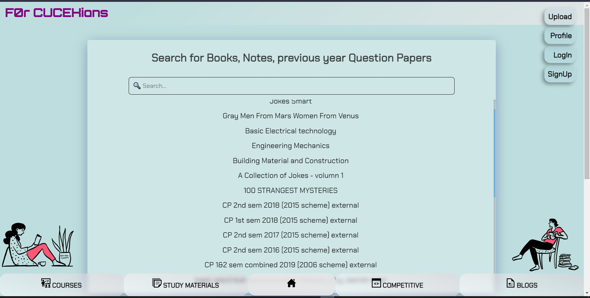

# forcucekians-frontend

forcucekians is made for collage students, where they can upload and download materials like books, notes etc., this repositary is frontend of [forcucekians]( https://forcucekians.me/ ) .
<br/><br/>
[forcucekians backend repo]( https://github.com/kumarvikramshahi/forcucekians-api )

### This project will solve problems of :-
* those students who don’t like to prepare their own notes and rush for it when exams are near.
* also of those who prepare their own notes and keep forwarding same material many times (just upload here and it will be accessible to everyone).

### Technology Stack
* CSS: Styling web pages, html files
* Javascript: Primary programing language
* ReactJS: Javascript library for building User Interfaces
* React-router-dom: library for routing in React
* Styled-components: CSS-in-JS library

### Local Installation
Note: Before installing make sure that you have 'Node.js' & 'git' installed in your computer.
* Go to folder where you want install this repo.
* Right click and you will get some options.
* Click on ' Git Bash Here ' and you will get a linux like [CLI](https://en.wikipedia.org/wiki/Command-line_interface).
* Clone repositary

```bash
git clone https://github.com/kumarvikramshahi/forcucekians-frontend.git
```
* Change directory to repo

```bash
cd forcucekians-frontend
```
* Install dependencies

```bash
npm install
```
* Start server

```bash
npm start
```
